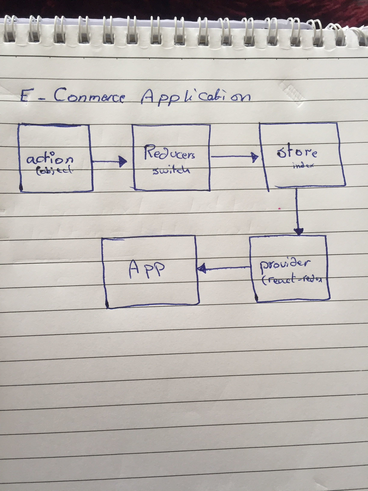

# redux-app
## LAb 36 - E - Commerce Application

## Authar : As-har Al-Oran 

## Resurses :

* (pull request) : [https://github.com/asharoran-401-advanced-javascript/redux-app/pull/1] .

## SetUp

- clone the repo
- npm install react react-scripts react-dom react-redux redux  redux-devtools-extension redux-mock-store
- npm run start 
- npm run test

## UML 
